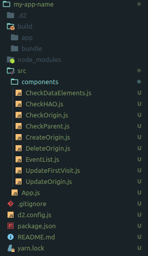

# Meningitis APP

DHIS2 standard webapp which controls the generation and management of origin events for _Meningitis Linelist_ metadata.

## Overview

_Meningitis App_ has been developed in _Javascript_ using _React_ framework as it is recommended by [DHIS2 core developer team](https://dhis2designlab.github.io/).

In order to keep coherence with DHIS2 css style and DHIS2 webapp development paradigm, [DHIS2 Application Plattform](https://platform.dhis2.nu/) has been used for bootstrapping Meningitis App. Along with styling, DHIS2 Application Plattform provides a series of custom React hooks, that have been used to make API requests and mutations.

EHAS delivers the app already bundled and ready to install in a DHIS2 instance (v.3x) through _App Management_ app.

## Purpose

_Meningitis App_ was designed for MSF-OCBA DHIS2 servers working together with Meningitis Linelist metadata, already configured by [EHAS Foundation](http://www.ehas.org/), as an extension of its functionality. This app interact with DHIS2 API in order to automatize the control and management of Meningitis patients that don't belong to the Health Area of Origin (HAO) of their reporting Health Structure. With this app, data entry process gets simplified for MSF-OCBA data clerks in this particular matter.

In order to facilitate the maintenance and/or modification of this app's code, this guide will help to MSF-OCBA technicians to:

- Setup a development environment
- Understand the execution's flow of the app
- Understand the structure of the app
- Build and bundle the app from its source code

## Setup a development environment

This section will explain how to setup a development environment to work with DHIS2 React Apps in general and with Meningitis App in particular.

### Prerequisites

- Nodejs: [NodeJS](https://nodejs.org/en/)
- Yarn: [Yarn](https://yarnpkg.com/getting-started/install)

### Installing

1.  Create a new folder:

        sudo mkdir newfolder && cd newfolder

2.  Install the dependencies

        sudo yarn global add @dhis2/cli

3.  Initialize

        sudo d2 app scripts init my-app-name

4.  Clone the repository

        sudo git init
        sudo git clone https://github.com/velasvalen17/meningitis-app.git

5.  Delete ./my-app-name/src folder and replace it by ./meningitis-app/src folder

        sudo rm -r ./my-app-name/src
        sudo mv ./meningitis-app/src ./my-app-name/

### Executing

Executing the app from the developer environment we have just setup requires two steps:

- User needs to be logged into the DHIS2 instance in a web browser before we execute the app from our development setup.

- We need to modify the default's apiVersion variable the app uses the first time the app is executed.

Taking this in consideration:

1.  Login into the DHIS2 instance in a web browser
2.  Start the app from ~/my-app-name

        sudo yarn start

3.  Edit the file ~/newfolder/my-app-name/.d2/shell/src/App.js and replace the apiVersion for the version of the DHIS2 instance where the app is gonna work

```javascript
const appConfig = {
  url:
    process.env.REACT_APP_DHIS2_BASE_URL || window.localStorage.DHIS2_BASE_URL,
        appName: process.env.REACT_APP_DHIS2_APP_NAME || "",
        apiVersion: parseInt(process.env.REACT_APP_DHIS2_API_VERSION) || 30,
  /*
    This is the default value and for our example needs to be changed from 32 to 30 because 
    of the DHIS2 server's version from MSF-OCBA
  */
};
```

## Execution flow chart

This section details the execution's flow of the app with a self-explanatory diagram:


> Note: In case the project org unit id changes, the first request to the API (EventList) should be changed in order to apply the logic of the app to the events which are descendants of the new project's org unit. This will be changed in EventList.js

```javascript
//EventList.js
const query = {
  events: {
    resource: "events.json",
    params: {
      orgUnit: "wg60MeX0Txd",
      ouMode: "DESCENDANTS",
      program: "VOEVJzwp4F7",
      lastUpdatedDuration: "300d",
      filter: "MZ5Ww7OZTgM:eq:First visit",
      skipPaging: "true",
    },
  },
};
```

## Structure of the app

The app request to the API a list of events which are:

- First visit type
- Belongs to the program selected
- Belong to the descendants orgUnits from the orgUnit selected
- Have been updated during the previous 300 days to the execution of the app

> Note: All these parameters can be changed adapting them to new scenarios

Then, the app iterates through this event list checking each event and deciding between:

- Doing nothing
- CreateOrigin event
- DeleteOrigin event
- UpdateOrigin event

In every case, the First Visit event related with each TEI will be updated by the UpdateFirstVisit component. It is designed this way to be sure the data elements related with every First Visit event have the correct values according with the HAO attribute of each TEI. So, no matter how many times the HAO attribute is edited and changed that the origin control data element will be always up to date once Meningitis App is executed.

Further description of every app's components are included as inline comments at the beginning of each file \*.js in components folder.

## Build and bundle

From the app folder (~/my-app-name):

        sudo yarn build

A new folder named _build_ will be created in your folder structure. In ~/build/bundle folder will be MeningitisApp's pack ready to get installed in the DHIS2 server.

This is how the example's folder structure of MeningitisApp should look like:



## Author

- **Sergio Valenzuela** - [EHAS Foundation](https://github.com/ehasalud) - _Design and development_ - [velasvalen17](https://github.com/velasvalen17)
